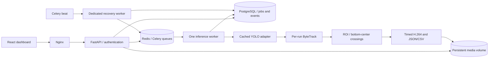

# TrafficVision AI

[](https://github.com/ikhsanhaidar/trafficvision-ai/actions/workflows/ci.yml)

Static-camera video analysis with YOLO11n, ByteTrack, and directional crossing counts. Upload a clip, draw an optional region of interest and one or more counting lines, run analysis, review the annotated video, and export JSON/CSV.

This is a portfolio MVP for a single trusted operator. It reports **crossing events**, not unique vehicles. A track is counted at most once per line per direction during a run. No speed estimation or live-camera support is included.

## Quick start: Windows, WSL or Linux

Install Docker Engine with Compose v2 (Docker Desktop in Linux-container mode on Windows) and [uv](https://docs.astral.sh/uv/getting-started/installation/). Keep at least 8 GB RAM and several GB of disk free for dependencies and media. CPU inference is the default; processing may be slower than playback on modest hardware.

Clone the repository, then generate local secrets and choose your administrator password:

```sh
git clone https://github.com/ikhsanhaidar/trafficvision-ai.git
cd trafficvision-ai
uv run --no-project --with "pwdlib[argon2]==0.2.1" python scripts/configure.py
docker compose up --build -d
docker compose logs -f worker
```

Press Ctrl+C to stop following the worker logs; the containers keep running. Open **http://localhost:8080** and sign in as `admin` with the password you chose. The first analysis downloads the configured YOLO11n checkpoint into the persistent model volume and can take longer. Subsequent runs reuse the model within each worker process. Upload media only when you have permission to process it.

If you change `APP_PORT` in `.env`, update the `localhost` and `127.0.0.1` entries in `TV_ALLOWED_ORIGINS` to that port as well; browser write requests require an exact allowed origin.

Windows PowerShell and WSL/Linux use the same commands above. In WSL, keep the checkout in the Linux filesystem for better I/O performance and enable Docker Desktop's WSL integration. In Windows PowerShell, run `npm.cmd` instead of `npm` if script execution policy blocks `npm.ps1`.

The API, database and Redis are private to the Compose network. Only the web server is published, bound to localhost. Stop with `docker compose down`; named volumes persist. The single scheduler and dedicated recovery worker must remain running for automatic stale-job recovery.

See [progress and verification](docs/PROGRESS.md) for what has actually been executed on the development host. Container build completion and functional tests are distinct from model accuracy evaluation.

## Try licensed footage

```sh
uv run --no-project python scripts/fetch_smoke_video.py
```

Upload `data/smoke/gothenburg.ogv`. The source is © 2009 Tomasz Sienicki, [CC BY 3.0](https://creativecommons.org/licenses/by/3.0/), [via Wikimedia Commons](https://commons.wikimedia.org/wiki/File:Changing_lanes_in_Gothenburg_ubt.ogv). Retain the adjacent source manifest and attribution when sharing an annotated derivative. This footage has no supplied ground truth and is a functional smoke test only.

Use the [five-minute demo guide](docs/DEMO.md) for the complete flow. All illustrative dashboard data is explicitly marked **Demo** and is separate from real run statistics.

## CLI and development

Python 3.12 is recommended; the backend supports Python 3.10–3.12. The committed `uv.lock` resolves the default CPU environment, including transitive dependencies and hashes.

```sh
uv sync --frozen
uv run trafficvision data/smoke/gothenburg.ogv --config examples/analysis.json --output artifacts/first-run
uv run pytest
uv run ruff check backend tests scripts
uv run ruff format --check backend tests scripts
```

The output directory must be new. It contains `annotated.mp4`, `result.json` (configuration, metadata, statistics and events), `summary.json`, `events.csv`, and `events.jsonl`. JSONL permits streaming event ingestion without loading all events into memory. Set `MODEL_CHECKPOINT` or pass `--checkpoint` to use a compatible local detector checkpoint. Only load checkpoints from trusted sources. Class IDs are resolved through checkpoint metadata, never assumed by the counting code.

For frontend development:

```sh
cd frontend
npm ci
npm run dev
npm run build
```

The Vite development proxy forwards `/api` to `http://localhost:8000`. To run the API/worker locally, supply PostgreSQL and Redis connection URLs in `.env`, run `uv run alembic upgrade head`, then start these in separate terminals:

```sh
uv run uvicorn trafficvision.api:app --reload
uv run celery -A trafficvision.celery_app:celery_app worker -Q analysis --concurrency=1 --prefetch-multiplier=1
uv run celery -A trafficvision.celery_app:celery_app worker -Q maintenance --concurrency=1
uv run celery -A trafficvision.celery_app:celery_app beat --schedule=artifacts/celerybeat-schedule
```

Celery production workers should run on Linux/WSL or Docker. Native Windows workers are not the deployment target. Test-only SQLite and injected synthetic detector/task dispatch are not replacements for the production PostgreSQL/Redis stack.

## Optional GPU

The optional Linux CUDA 12.8 environment uses `requirements-gpu.lock`, generated separately from the CPU lock. Install an appropriate NVIDIA driver and [NVIDIA Container Toolkit](https://docs.nvidia.com/datacenter/cloud-native/container-toolkit/latest/install-guide.html), then run:

```sh
docker compose -f compose.yaml -f compose.gpu.yaml up --build -d
```

Choose `cuda:0` in New Analysis. A missing GPU produces an actionable failed job; it does not silently switch devices. GPU execution is only considered verified after a run on compatible hardware. Keep inference concurrency at one unless you have measured available memory.

## Architecture and counting policy



- All geometry is normalized to the original decoded frame. Bottom-center box coordinates are used for trajectories. The preview uses that same orientation and aspect ratio; rotated source media is rejected with a normalization message.
- Lines are directed from their start point to their end point. **A** is the negative cross-product side, **B** the positive side, in image coordinates (y increases downwards). A left-to-right horizontal line has A above and B below.
- A crossing requires a real trajectory segment to intersect the finite line segment, an eventual change of stable side outside the hysteresis band, and minimum track age. Event times interpolate source timestamps around the intersection. The class is confidence-voted and frozen after its first count.
- Track gaps and ROI exits reset trajectories; counted-direction records remain for the run. ID switches and reappearing vehicles may still inflate counts. Camera motion, severe occlusion, tiny objects and domain differences can reduce accuracy.
- Frames are streamed with one-frame lookahead for timing. Annotated output preserves relative presentation timestamps, omits audio, and pads odd dimensions by one pixel for H.264. The decoder validates the full upload, including duration/resolution/frame limits, before a job is created.
- Result directories are published atomically on one filesystem. Database attempt ownership fences duplicate deliveries and stale workers. Results become accessible only after success is committed. Retry starts a fresh attempt; old task messages cannot claim it.

## Security and data lifecycle

Credentials use Argon2 hashing and a signed, expiring HTTP-only SameSite cookie. Secrets live in `.env`; the example contains no actual credentials. Authentication protects media previews, videos and exports. Browser write requests require an allowed origin. Filenames are display metadata only; generated IDs control private storage paths. File size and decoder limits are enforced. Configure explicit origins and secure cookies behind HTTPS before exposing the service beyond localhost.

The default deployment is for one trusted administrator. It has no public registration, multi-tenant roles, or Internet deployment hardening. A compromised administrator can access this workspace's videos.

Delete terminal jobs through History to remove their result data. See [API documentation](docs/API.md) for unused-upload deletion. For complete local erasure, stop the stack and run `docker compose down --volumes`; this irreversibly removes database, queue, video and model volumes. Local CLI artifacts and downloaded smoke footage are separate directories and must be deleted separately. Backups and copied exports require separate deletion.

## Evaluation and project documentation

- [Model card](docs/MODEL_CARD.md), [sources and licenses](docs/SOURCES.md)
- [Annotation protocol](docs/ANNOTATION.md), [evaluation report and commands](docs/EVALUATION.md)
- [API reference and failure handling](docs/API.md), [implementation progress](docs/PROGRESS.md)

Detection evaluation reports precision, recall and mAP only against bounding-box ground truth. Counting evaluation reports absolute error and MAE across complete video/class/direction grids, including zero counts. IDF1/HOTA require matching identity annotations. No accuracy numbers are prefilled. Training is an explicit offline step after data, disjoint video/camera splits and compute are ready.

Roadmap after MVP verification: RTSP/webcam inputs, multiple cameras, calibrated speed estimation, richer identity evaluation, and measured optimizations. Speed estimation requires validated spatial and time calibration first.

Application source is **AGPL-3.0-only**; see [LICENSE](LICENSE). Upstream model, data and codec licenses also apply; this repository does not redistribute the smoke video or checkpoint in source control.
