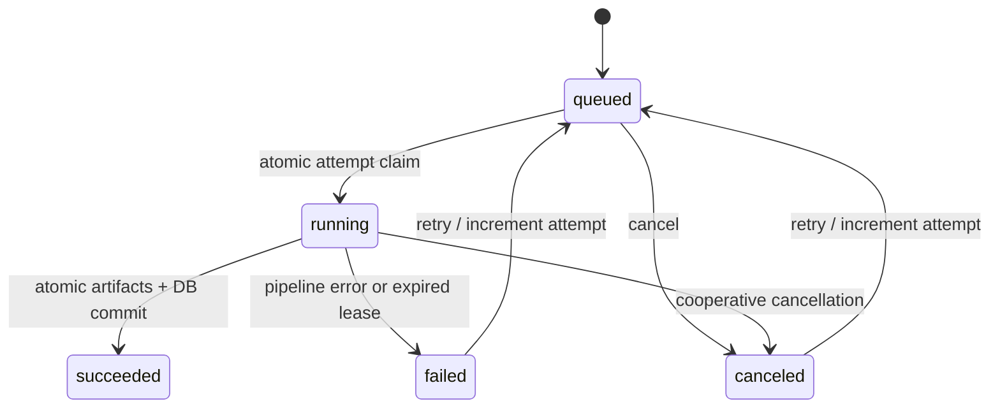

# API reference

The backend exposes `/api`. Interactive OpenAPI documentation is available at `/api/docs` when routed through the web proxy; the JSON schema is `/api/openapi.json`. The generated schema is authoritative for request validation. Authenticate first; media and export links use the same session cookie as the dashboard.

## Main flow

| Method | Endpoint | Purpose |
| --- | --- | --- |
| POST | `/api/auth/login` | JSON `{ "username": "admin", "password": "..." }`; sets HTTP-only session cookie |
| GET | `/api/auth/me` | Current user; 401 without a valid session |
| POST | `/api/auth/logout` | Clear browser session cookie |
| GET | `/api/settings` | Supported classes, devices, model checkpoint, upload/decoder limits |
| POST | `/api/videos` | Multipart `file`; streamed size enforcement, full decoder validation, preview creation |
| GET | `/api/videos/{id}/preview` | Protected JPEG preview |
| DELETE | `/api/videos/{id}` | Delete an unused upload; active references prevent deletion |
| POST | `/api/jobs` | JSON `{ "video_id": "uuid", "configuration": {...} }`; commit queued job and dispatch |
| GET | `/api/jobs?offset=0&limit=20` | Paginated analysis history `{items,total}` |
| GET | `/api/jobs/{id}` | Current status, progress, timing, attempt and configuration |
| POST | `/api/jobs/{id}/cancel` | Cancel queued work immediately or signal the running attempt |
| POST | `/api/jobs/{id}/retry` | Queue a new attempt of a failed/canceled job |
| GET | `/api/jobs/{id}/result` | Successful run summary and provenance |
| GET | `/api/jobs/{id}/events?offset=0&limit=100` | Paginated event table `{items,total}` |
| GET | `/api/jobs/{id}/video` | Protected annotated MP4, supporting byte-range playback |
| GET | `/api/jobs/{id}/export?format=json` | Full JSON result with events; `format=csv` exports event rows |
| DELETE | `/api/jobs/{id}` | Delete a terminal job and its results |
| GET | `/api/health/live` | Process liveness; no authentication |
| GET | `/api/health/ready` | Database and Redis availability; no authentication |

Polling every two seconds is sufficient for MVP. Progress is 0–1 and measures source-video coverage; encoding verification/publication may take additional time after the last frame. Running throughput includes work elapsed so far; final throughput uses measured pipeline processing time. Video timestamps are seconds relative to the first source frame, independent of job wall-clock timestamps.

Example configuration is in [`examples/analysis.json`](../examples/analysis.json). Polygon and line coordinates are 0–1; ROI may be empty to select the entire frame. At least one nonzero line is required. Duplicate IDs, malformed polygons, unsupported classes/devices/resolutions and out-of-bounds points fail schema validation.

## States and retries

Database rows are the dispatch outbox. If Redis is temporarily unavailable after job creation, the committed queued job remains recoverable. Celery beat dispatches recovery onto the separate maintenance queue; stale running attempts become failed/canceled with an actionable message. Old or duplicate deliveries cannot claim a newer attempt. Events and final result pointers become visible in the same success transaction.

Cancellation is cooperative. It is checked between frames and before publication; native model initialization/encoding calls must return first. A hard processing-time limit and lease recovery cover workers that stop responding. A failed attempt never supplies a successful result download.

## Authentication and deployment

Sessions are signed with `TV_SECRET_KEY`, expire, and use Argon2 password verification. Allowed browser origins are explicit in `TV_ALLOWED_ORIGINS`. Nginx and API upload limits bound request size. Video filenames never become filesystem paths. Private storage paths use generated UUIDs. API errors do not expose secrets or internal storage paths; structured worker logs include the job ID for diagnosis.

For an API client, retain cookies from login and send an allowed `Origin` on browser-style write requests. The browser performs this automatically. Use HTTPS with `TV_COOKIE_SECURE=true` if deploying beyond local development. This release has one administrator and no per-tenant authorization model.

Back up the database and media volumes together. Before deleting local data, verify which Compose project/volumes you are targeting. Deleting a job cannot erase exports copied elsewhere.
